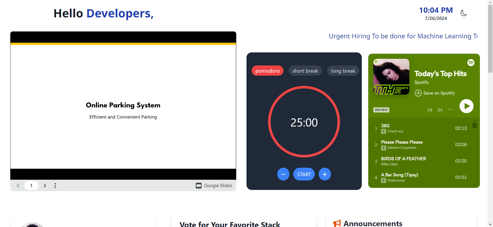
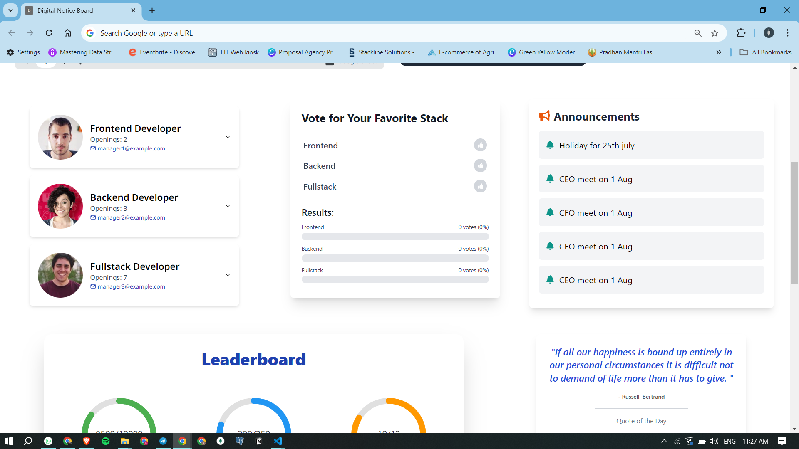
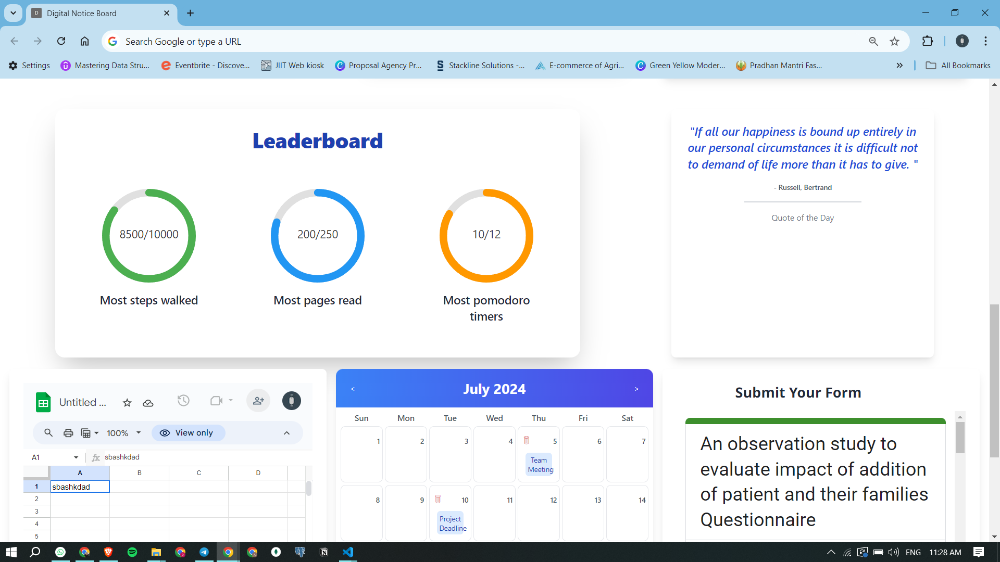
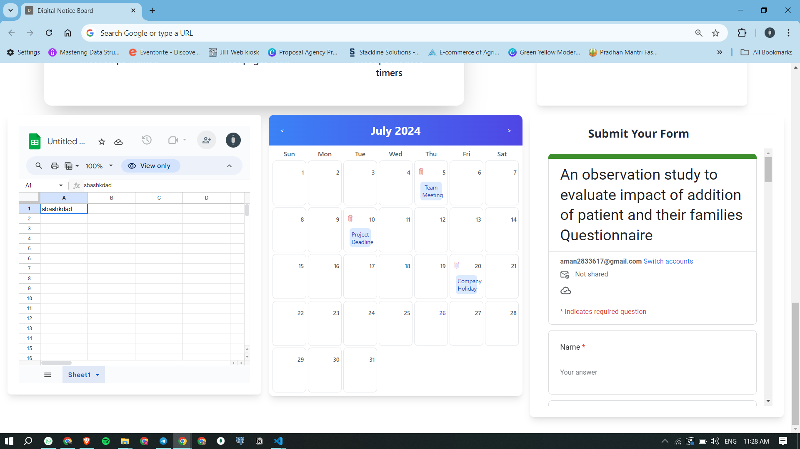
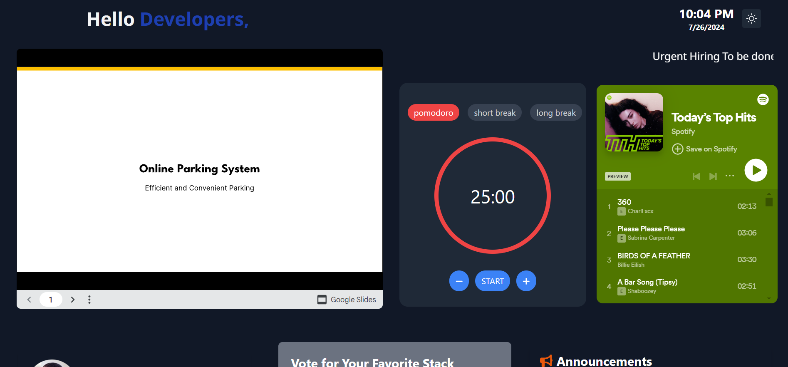
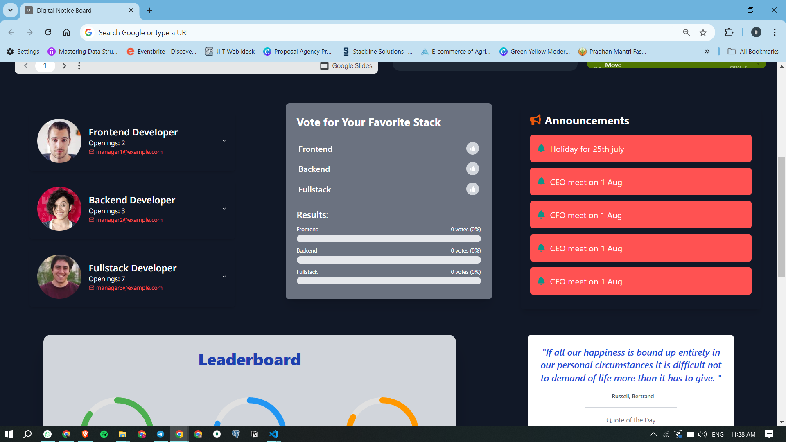
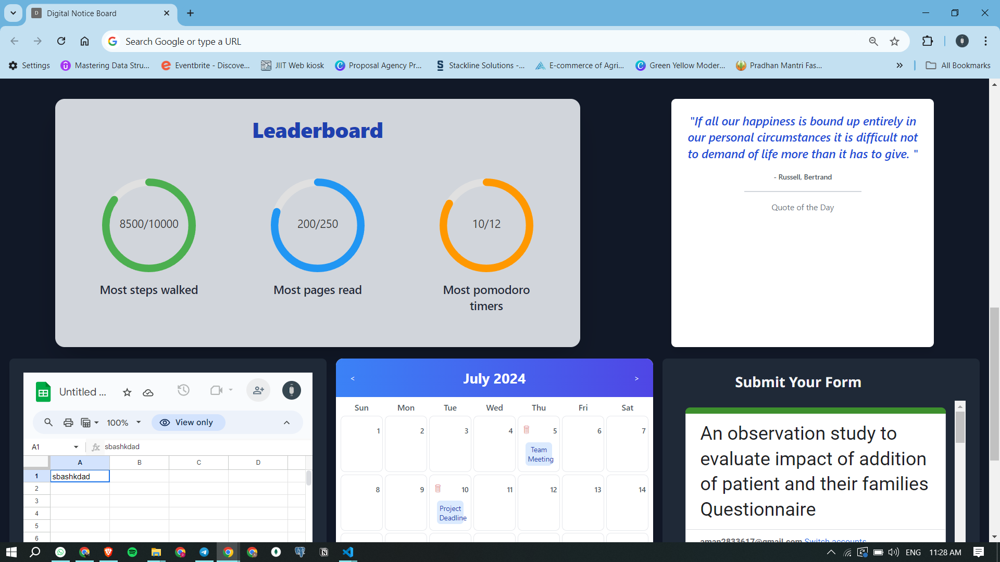
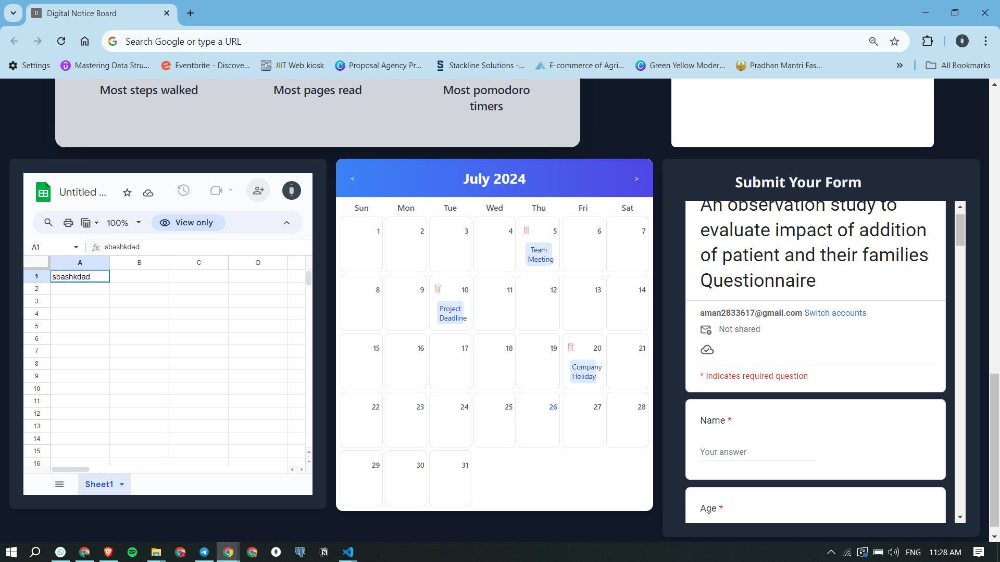

# Digital Notice Board Chrome Extension

## Overview

The Digital Notice Board Chrome Extension is designed to enhance communication and collaboration within a scaling company. It integrates various widgets, including Google Slides, Pomodoro Timer, Google Spreadsheet, Google Form, and more. The extension features a drag-and-drop Kanban-style interface, dark mode toggle, and a highly intuitive UI built with Tailwind CSS.

## Features

###  Widgets
- Google Slides Integration
- Pomodoro Timer
- Google Spreadsheet
- Google Form
- Music Player (Spotify/YouTube integration and playback controls)
- Poll
- Book + Quote
- Issue Tracker
- Daily Growth Checklist
- Announcements with Scrolling Text
- Steps/Health Tracker
- Opportunity Board
- Generic Leaderboard
- Today I Learned Corner
- Google Calendar Day View
- Google Meet Widget
- Google Keep Widget
- ChatGPT/Perplexity Chat Box
- Specific Notion Page

## UI and Design

- **Tailwind CSS** for styling
- **Dark Mode Toggle**
- **Drag-and-Drop Kanban Style Interface**
- **Glassmorphic UI** for an eye-catching design

## Screenshots

### Dashboard Overview










## Installation

1. Clone the repository:
    ```bash
    git clone https://github.com/yourusername/digital-notice-board.git
    ```
2. Navigate to the project directory:
    ```bash
    cd digital-notice-board
    ```
3. Install the dependencies:
    ```bash
    npm install
    ```
4. Build the project:
    ```bash
    npm run build
    ```
5. Load the extension in Chrome:
    - Open Chrome and go to `chrome://extensions/`
    - Enable **Developer mode** (top right)
    - Click **Load unpacked** and select the `build` folder

## Usage

1. **Add Widgets**: Click on the widget button to add the desired widgets to your notice board.
2. **Customize Layout**: Use the drag-and-drop feature to organize your widgets.
3. **Toggle Dark Mode**: Click the dark mode toggle to switch between light and dark themes.

## Development

### Prerequisites

- Node.js
- npm

### Running Locally

1. Start the development server:
    ```bash
    npm start
    ```
2. Open your browser and go to `http://localhost:3000`

### Building for Production

1. Build the project for production:
    ```bash
    npm run build
    ```

## Contribution

1. Fork the repository
2. Create a new branch:
    ```bash
    git checkout -b feature/your-feature
    ```
3. Make your changes and commit:
    ```bash
    git commit -m "Add your feature"
    ```
4. Push to the branch:
    ```bash
    git push origin feature/your-feature
    ```
5. Open a pull request

## License

This project is licensed under the MIT License. See the [LICENSE](LICENSE) file for details.

## Contact

For any questions or feedback, please reach out to [aman2833617@gmail.com](mailto:your.email@example.com).

---

Replace the `path/to/...` placeholders with the actual paths to your screenshots.
